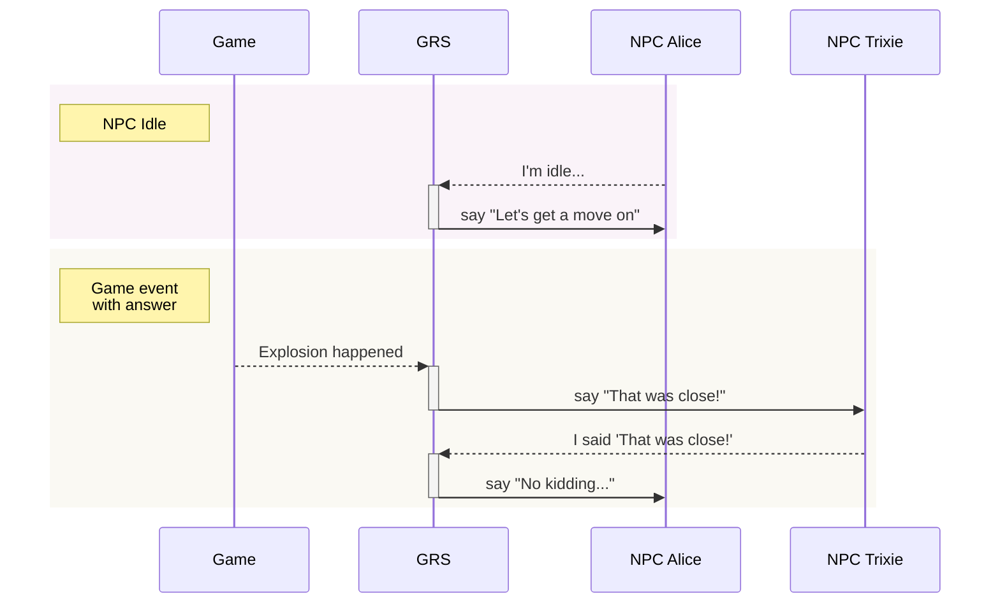

# Godot Response System

GRS lets NPCs and other entities in your game respond (speak, do actions, etc) based on what happens in the game and what others do/say. Writers can easily add, remove, or edit responses in your game's GRS spreadsheet, which is exported and then loaded by the system, which tells the entities in your game what to do in response to inputs.

It's designed after Valve's response system used in the Source engine, and described in their GDC talk ["Rule Databases for Contextual Dialog and Game Logic"](https://youtu.be/tAbBID3N64A). It also borrows heavily from the [Response System docs](https://developer.valvesoftware.com/wiki/Response_System) on the Valve Developer Wiki.

---

## Overview

I recommend watching the talk above, that gives you a good idea of why and how the system works. But basically:

- Your game runs an instance of the Godot Response System.
- GRS contains all rules about how to respond to an input.
- Every entity that may respond based on the GRS (NPCs, etc) have a `GrsEntity` attached to them. The `GrsEntity` emits signals which the entity can use to speak, do actions, etc.
- Your game sends inputs to GRS whenever something that may need to be responded to happens. The system decides whether, and how to, respond.

Here are some examples of how the Game, GRS, and NPCs may interact. Dashed lines are inputs and solid lines are signals emitted from the given `GrsEntity`:

-----

## Parts of the response system

### Concepts

- **Fact dictionaries.**
	- A GRS fact dictionary contains context around either the game itself, the entity it's attached to, or the query it's attached to.
	- The way GRS gets game context is by looking at the values in fact dictionaries.
- **Concept.**
	- Describes why the response system is being polled.
	- Each query contains a context, e.g. 'idle' (entity is idle), 'question' (entity is asking a question), 'answer' (entity is giving an answer), 'got hit' (entity just got hit by something).
- **Criteria.**
	- Named true/false check, and are used when creating rules. Criteria can be calculated once and then used by multiple rules.
	- Example: The criterion `PlayerNearby` is true if `playerDistance < 300`.
- **Rules.**
	- These are the main things that `GRS` evaluates.
	- A rule includes one or more criteria to match, and the response(s) to trigger as a result.
- **Responses.**
	- Responses take a rule and... define how an entity should respond to that rule! These include the lines of text to say, actions to take, and more.

### Nodes

- `GRS` (the main response system):
	- A `GRS` singleton is added to your game.
	- The main `GRS` fact dictionary contains context like the current map/level, the player health, etc.
- `GrsEntity` (one for each NPC / etc):
	- When added to the node tree, it adds itself to `GRS`. This lets that entity receive events from `GRS`, which the entity then emits as signals.
	- When removed from the node tree, it removes itself from `GRS`.
- `GrsQuery` (submitted for each event/etc to be evaluated).
	- One of these is created for each event to be evaluated by `GRS`.
	- Contains:
		- `concept`: tells `GRS` what kind of event it's receiving (idle, question, answer, just hit, etc).
		- `entity`: which entity originated this query.
		- fact dictionary: contains context related to the query itself.
	- When evaluating a `GrsQuery`, `GRS` looks at these fact dictionaries in order:
		- `GrsQuery`'s fact dictionary (most specific, contains concept, etc).
		- `GrsEntity`'s fact dictionary (contains the entity's class name, health, current action/state, etc).
		- `GRS` root fact dictionary (contains the level/scene name, player health, any other game-wide info that may affect responses).

-----

## Using the response system

...

