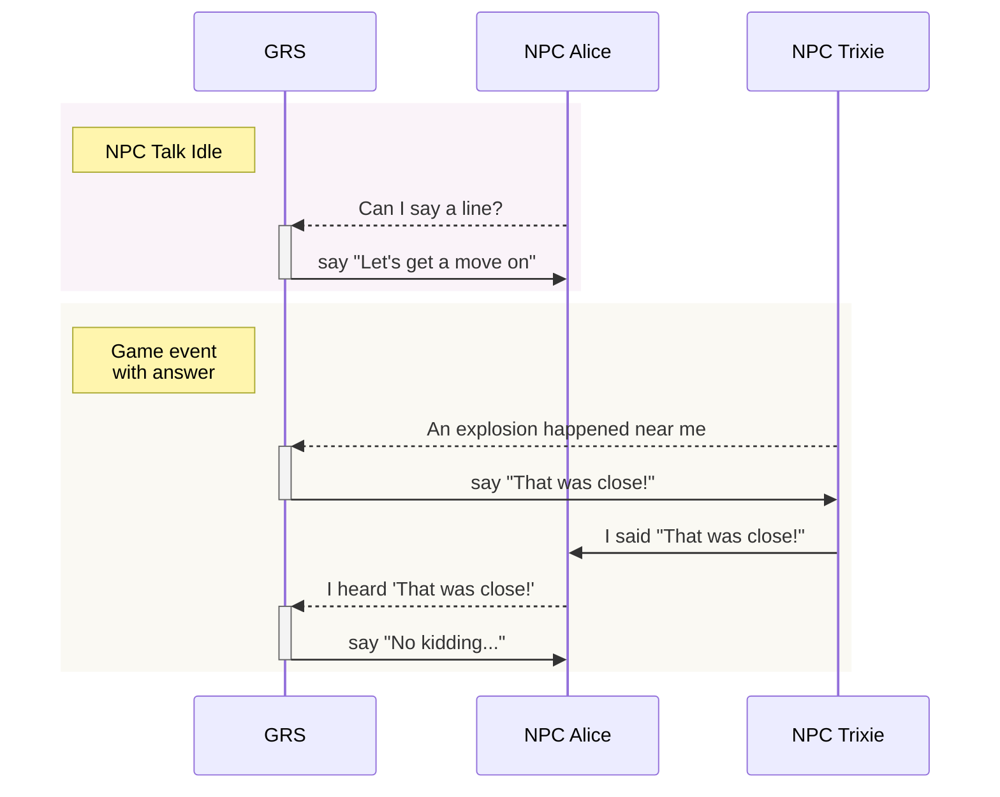
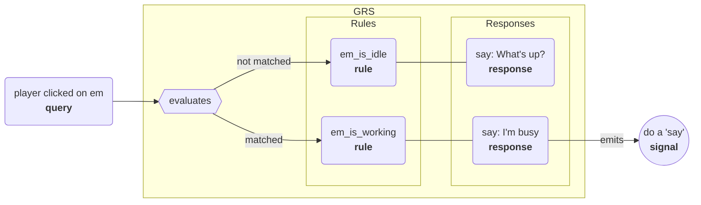

# Godot Response System

GRS lets NPCs and other entities in your game respond (speak, animate, do actions, etc) based on what happens in the game and what others do/say. Writers can easily add, remove, or edit responses in your game's GRS spreadsheet, which is exported and then loaded by the system, which tells the entities in your game what to do in response to inputs.

---

## Overview

GRS is designed after Valve's response system used in the Source engine, and described in their GDC talk ["Rule Databases for Contextual Dialog and Game Logic"](https://youtu.be/tAbBID3N64A). It also borrows heavily from the [Response System docs](https://developer.valvesoftware.com/wiki/Response_System) on the Valve Developer Wiki. I recommend watching that talk and reading that page, as it'll give you a good idea of why and how this system works.

But basically:

- The system is designed to make contextual dialog, actions, sounds, and more easy to manage.
- It's designed with **writers** in mind, and tries to make it as easy as possible for them to create and edit responses.

To do so:

- Your game runs an instance of the Godot Response System (GRS).
- Every entity that can respond (NPCs, etc) is an 'actor'.
- GRS contains rules, and each rule has a response or group of responses.
- Your actors send queries to GRS whenever _something they may need to respond to_ happens.
- GRS finds the rule that best matches the query, and then sends that response back to the actor.
- Your actors emit signals containing the response info. For example the name of the animation to play, the text to display, etc. And this is what your game hooks into!

-----

Here are some high-level examples of how the Game, GRS, and NPCs may interact. Dashed lines are queries sent to GRS and solid lines are signals emitted from the given `GrsActor`:

GRS accepts incoming queries and emits signals based on that!

-----

Here's what happens when a query is evaluated by GRS:

Basically, when a query is dispatched to `GRS` it evaluats the rule database. If found, the best matching rule's response is used. The response emits a signal from the `GrsActor` that's evaluating the query. The node with that `GrsActor` can then accept that signal and, for example, display the string in a textbox or play a voice line.

-----

## Parts of the response system

### Basics

- **Fact dictionaries.**
	- A GRS fact dictionary contains context about the world, actor, and more, which inform response choices.
	- GRS sees game context by looking at the values in fact dictionaries.
- **Concept.**
	- Describes why the response system is being polled.
	- Each query contains a context, e.g. 'idle' (actor is idle), 'question' (actor is asking a question), 'answer' (actor is giving an answer), 'got hit' (actor just got hit by something).
- **Criteria.**
	- Named true/false check, and are used when creating rules. Criteria can be calculated once and then used by multiple rules.
	- Example: The criterion `PlayerNearby` is true if `playerDistance < 300`.
- **Rules.**
	- These are the main things `GRS` evaluates.
	- Contains one or more criteria to match, and the response(s) to trigger as a result.
- **Responses.**
	- Responses take a rule and... define how an actor should respond to that rule! These include the lines of text to say, actions to take, and more.

### Nodes

- `GRS` (the main response system):
	- A `GRS` singleton is added to your game.
	- The main `GRS` fact dictionary contains context like the current map/level, the player health, etc.
- `GrsActor` (one for each NPC / etc):
	- When added to the node tree, it adds itself to `GRS`. This lets that actor receive events from `GRS`, which the actor then emits as signals.
	- When removed from the node tree, it removes itself from `GRS`.
- `GrsQuery` (submitted for each event/etc to be evaluated).
	- One of these is created for each event to be evaluated by `GRS`.
	- Queries are **dispatched** to `GRS`.
	- Contains:
		- `concept`: tells `GRS` what kind of event it's receiving (idle, question, answer, just hit, etc).
		- `actor`: which actor originated this query.
		- fact dictionary: contains context related to the query itself.
	- By default, these fact dictionaries are evaluated in order:
		- `GrsQuery`'s fact dictionary (most specific, contains concept, etc).
		- `GrsActor`'s fact dictionary (contains the actor's class name, health, current action/state, etc).
		- `GRS` root fact dictionary (contains the level/scene name, player health, any other game-wide info that may affect responses).
	- But you can also supply extra fact dictionaries. For example, maybe you want to supply a 'map' fact dictionary, a fact dictionary about the actor's faction or guild, or something different.

-----

## Using the response system

