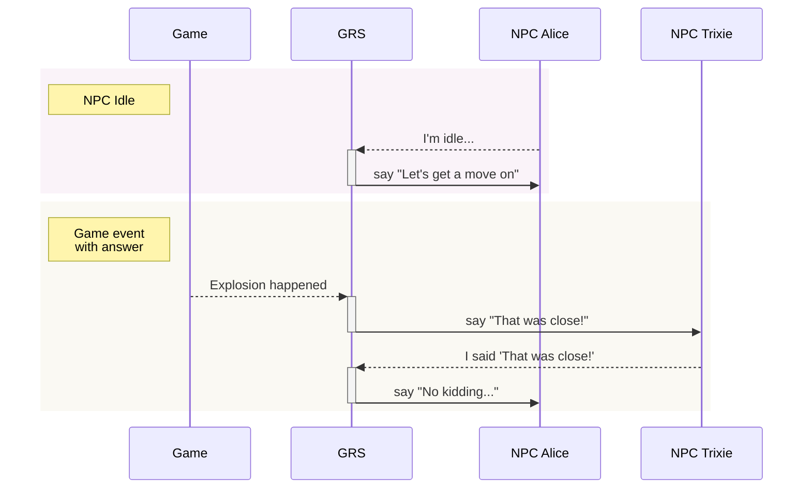

# Godot Response System

GRS lets NPCs and other entities in your game respond (speak, do actions, etc) based on what happens in the game and what others do/say. Writers can easily add, remove, or edit responses in your game's GRS spreadsheet, which is exported and then loaded by the system, which tells the entities in your game what to do in response to inputs.

It's designed after Valve's response system used in the Source engine, and described in their GDC talk ["Rule Databases for Contextual Dialog and Game Logic"](https://youtu.be/tAbBID3N64A). It also borrows heavily from the [Response System docs](https://developer.valvesoftware.com/wiki/Response_System) on the Valve Developer Wiki.

---

## Overview

I recommend watching the talk above, that gives you a good idea of why and how the system works. But basically:

- Your game runs an instance of the Godot Response System.
- GRS contains all rules about how to respond to an input.
- Every entity that may respond based on the GRS (NPCs, etc) have a `GrsEntity` attached to them. The `GrsEntity` emits signals which the entity can use to speak, do actions, etc.
- Your game sends inputs to GRS whenever something that may need to be responded to happens. The system decides whether, and how to, respond.

Here are some examples of how the Game, GRS, and NPCs may interact. Dashed lines are inputs and solid lines are signals emitted from the given `GrsEntity`:

