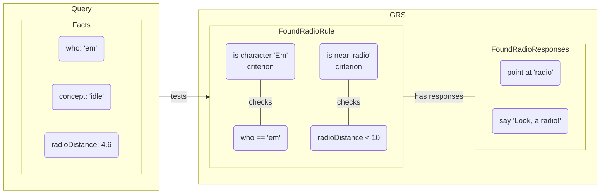
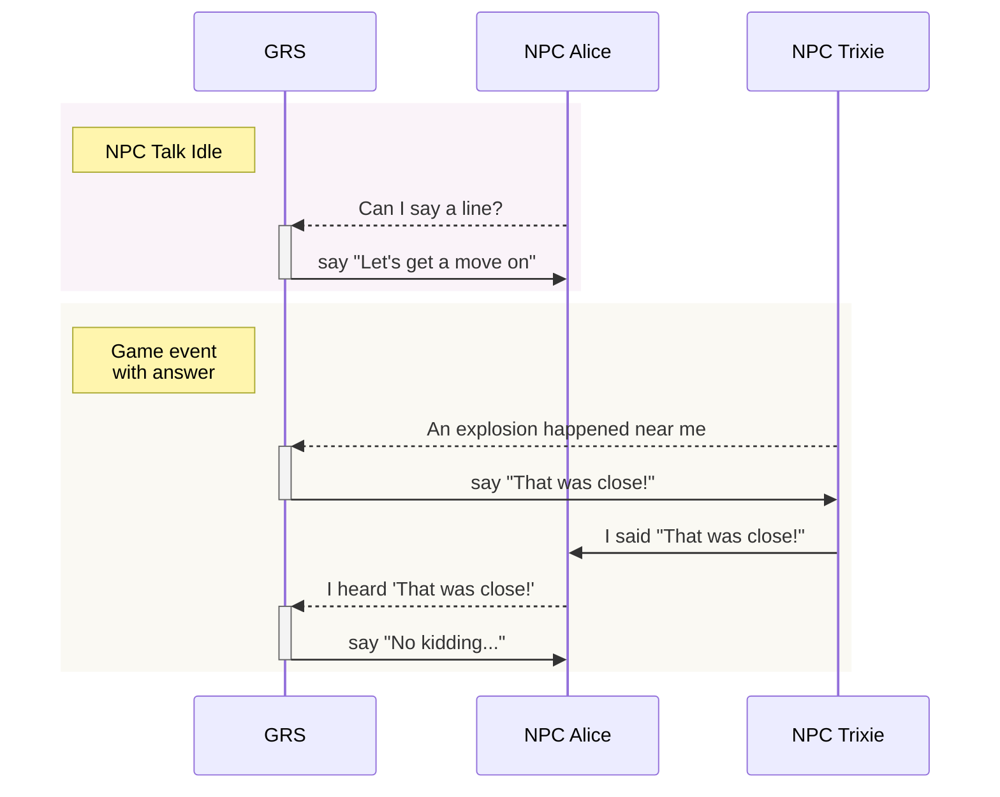
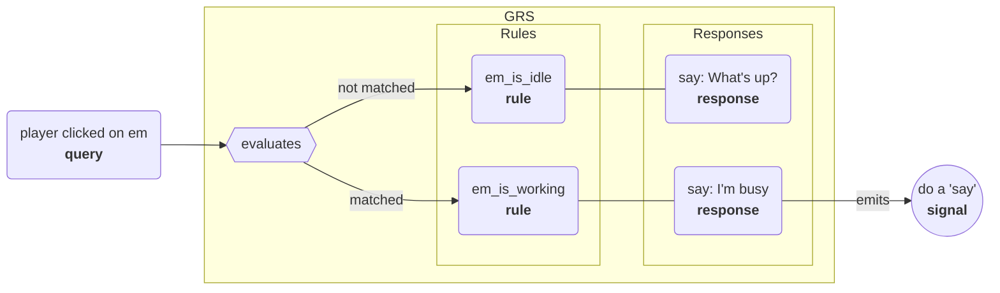

# Godot Response System

GRS lets NPCs and other entities in your game respond (speak, animate, do actions, etc) based on what happens in the game and what others do/say. Writers can easily add, remove, or edit responses in your game's GRS spreadsheet, which is exported and then loaded by the system, which tells the entities in your game what to do in response to inputs.

## Overview

GRS is designed after Valve's response system used in the Source engine, and described in their GDC talk ["Rule Databases for Contextual Dialog and Game Logic"](https://youtu.be/tAbBID3N64A). It also borrows heavily from the [Response System docs](https://developer.valvesoftware.com/wiki/Response_System) on the Valve Developer Wiki. I recommend watching that talk and reading that page, as it'll give you a good idea of why and how this system works.

Basically:

- The system is designed to make contextual dialog, actions, sounds, and more easy to manage.
- It's designed with **writers** in mind, and tries to make it as easy as possible for them to create and edit responses.

To do so:

- Your game runs the Godot Response System (GRS).
- Each entity that can respond (NPCs, etc) is an 'actor'.
- Your actors send queries to GRS whenever **something they may need to respond to** happens.
- GRS searches the rule database you've loaded, and if there's a matching rule GRS sends the response to the actor.
- The actor emits a signal containing the response info. e.g. the name of the animation to play or the text to display.

## Response system data

Here's a description of the different types of files the response system loads. Our default importer takes CSV files, which can be exported from a copy of the [GRS spreadsheet](https://docs.google.com/spreadsheets/d/1JIgC-Pu2sS9v4Bf35eo1QU7qvDjbHmdbWrxSLtxYTEU/edit?usp=sharing).

Here's how the types of data are related:

-----

### Concepts
These describe why the response system is being queried. These are events the programmers need to send to the response system for it to work, e.g. 'idle' (actor is idle), 'got hit' (actor just got hit by something).

Columns:
- `name`: simple, the name of this concept.
- `priority`: concepts default to a priority of `0`. Concepts with a higher priority (`1`, `2`, `3`, etc) will interrupt concepts with a lower priority (for example, to let a death noise interrupt normal dialogue). If `nopriority` is given as a concept's priority, that concept will never interrupt any other speech and the system will act as though no event is happening when other responses check for activity.

### Criteria
A criterion is a named true/false check, and are used when creating rules. For example, the criterion `PlayerNearby` may be true if `playerDistance<300`. Criteria can be calculated once and then used by multiple rules, which helps with performance.

Columns:
- `name`: the name of this criterion. e.g. `PlayerIsHurt`, `PlayerReallyHurt`, `TurretNearby`.
- `fact`: the name of the fact to compare against, e.g. `playerDistance`, `cash`, `name`.
- `match`: check to perform against the given fact:
	- Equals value: `250`, `"charlie"` (the quotation marks are required for strings)
	- Not equal to: `!=250`, `!="bob"` (the quotation marks are required for strings)
	- Range: `<300` (less than 300), `<=20` (less than or equal to 20), `>30,<50` (between 30 and 50)
- `weight`: weight of this criterion when comparing different rules. defaults to `1.0`.
- `optional`: means that this criteria is optional (the rule can still succeed if this criterion fails, this just adds weight if true).

Criterion recommendations:
- Name: `Concept*`, Fact: `concept`, Checks the current concept. e.g. `ConceptIdleTalk`, `ConceptHit`.
- Name: `Is*`, Fact: `who`, Who is the current actor evaluating this check. e.g. `IsDaniel`, `IsEm`.
- Name: `Map*`, Fact: `map` or `level`, The level/map we're on.

### Rules
These include one or more criteria to match, and one or more response groups to trigger. The **rule database** is what GRS compares incoming queries against.

Columns:
- `name`: the name of this rule.
- `criteria`: list of criteria to match, separated by spaces.
- `flags`: flags that apply to this rule
	- `norepeat`: once this rule has matched once, disable it so it can't trigger again.
	- `first`: ignore the calculated weights of all matching rules, fire this rule first.
	- `last`: ignore the calculated weights of all matching rules, fire this rule last.
- `responses`: one or more responses to trigger (usually just one).
- `applyactor`: extra context to apply to the actor's fact dictionary.
- `applyworld`: extra context to apply to the world's fact dictionary.

Rule recommendedations:
- Start a rule's name off with the entity it's evaluated on. For example, if it's checking whether a character named Em is idle, name the rule "EmIdle".

### Responses
These describe how actors respond once a rule is matched. These include the lines of text to say, actions to take, and more.

**Response groups** include more than one response. How this works is that there are more than one response which GRS treats as variants, randomly picking between them. When you are using a response group, fill **only the `name` and `flags` column** in the first line, with any group-specific flags. Then for the responses in that group, use the following lines **with an empty name column**.

Columns:
- `name`: the name of this response group.
- `flags`: flags that apply to this response or response group, separated by spaces:
	- group flags:
		- `permitrepeats`: by default, all responses in the group are visited before repeating any.
		- `sequential`: by default, responses are chosen randomly. with this, start at first and end at last in the list.
		- `norepeat`: once we've run through all entries, disable the response group.
	- individual response flags:
		- `first`: fire this response first in the group.
		- `last`: fire this response last in the group.
		- `norepeat`: once we've sent this response, disable it so it can't trigger again.
- `responsetype`: one of: 'say' (say the response), 'log' (log to console).
- `response`: if 'say' or 'log', then text.
- `delay`: mark the character as 'busy' for this long. defaults to some length of time we guess...
- `odds`: if under 100, that much of a % chance this response actually fires (if it doesn't fire, no response is sent). defaults to 100.
- `resaydelay`: don't use this response again for this many seconds. default 0.
- `weight`: if there are multiple responses, weight this one accordingly. default 1.
- `then`: fire this new criteria on the given actor. `any` to test every nearby actor. any matching responses are then chosen between, so that only one response is ever run based on an 'any' query, as the actor is the one querying its neighbours – see [this part of the talk](https://youtu.be/tAbBID3N64A?t=3341).

Response recommendations
- Using the same name for a rule and its triggered response / group is a good idea, if only one or a main unique one is triggered by a rule.

## Response system nodes

- `GRS` (the main response system):
	- A `GRS` singleton is added to your game by the plugin.
	- The main `GRS` fact dictionary contains context like the current map/level, the player health, etc.
- `GrsActor` (one for each NPC / etc):
	- When added to the node tree, it adds itself to `GRS`. This lets that actor get responses from `GRS`, which the actor then emits as signals.
	- When removed from the node tree, it removes itself from `GRS`.
- `GrsFactDictionary`:
	- Contains context about the world, actor, and more, which inform response choices.
	- GRS sees game context by looking at the values in fact dictionaries.
- `GrsQuery` (submitted for each event/etc to be evaluated).
	- One of these is created for each event to be evaluated by `GRS`.
	- Queries are **dispatched** to `GRS`.
	- Contains:
		- `concept`: tells `GRS` what kind of event it's receiving (idle, question, answer, just hit, etc).
		- `actor`: which actor originated this query.
		- fact dictionary: contains context related to the query itself.
	- By default, these fact dictionaries are evaluated in order:
		- `GrsQuery`'s fact dictionary (most specific, contains concept, etc).
		- `GrsActor`'s fact dictionary (contains any information set on the actor).
		- `GRS` root fact dictionary (contains any game-wide info that may affect responses).
	- But you can also supply extra fact dictionaries. For example, maybe you want to supply a 'map' fact dictionary, a fact dictionary about the actor's faction or guild, or something different.

-----

## Examples

Here are some high-level examples of how the Game, GRS, and NPCs may interact. Dashed lines are queries sent to GRS and solid lines are signals emitted from the given `GrsActor`:

GRS accepts incoming queries and emits signals based on that!

-----

Here's what happens when a query is evaluated by GRS:

Basically, when a query is dispatched to `GRS` it evaluats the rule database. If found, the best matching rule's response is used. The response emits a signal from the `GrsActor` that's evaluating the query. The node with that `GrsActor` can then accept that signal and, for example, display the string in a textbox or play a voice line.
