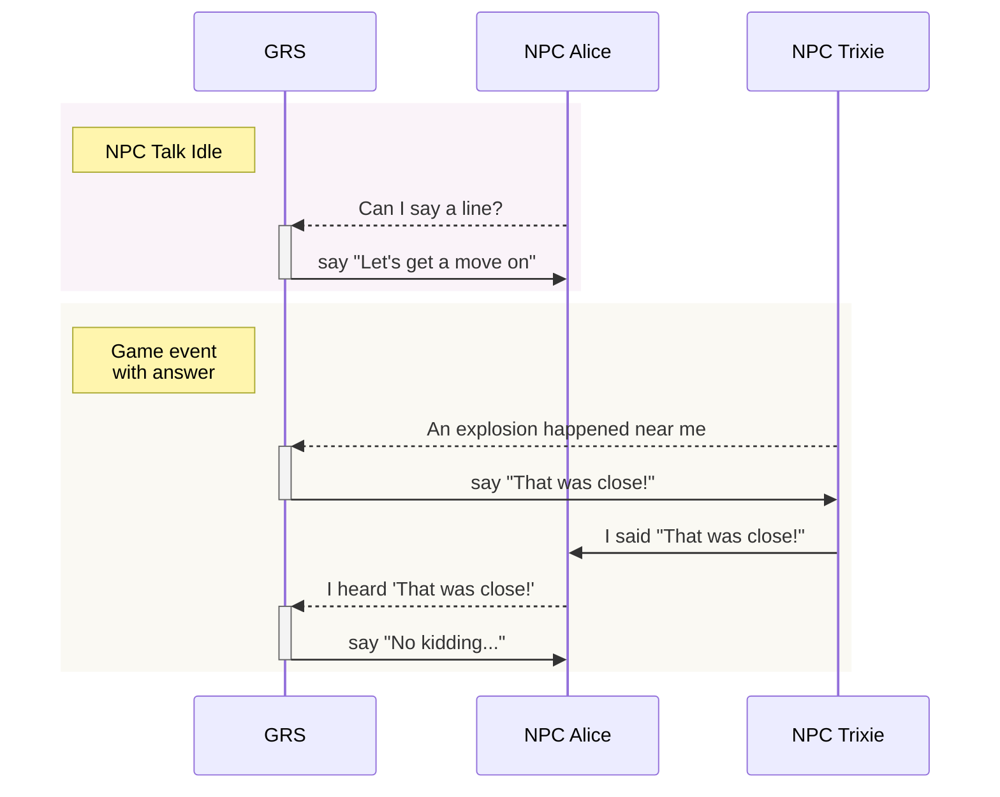
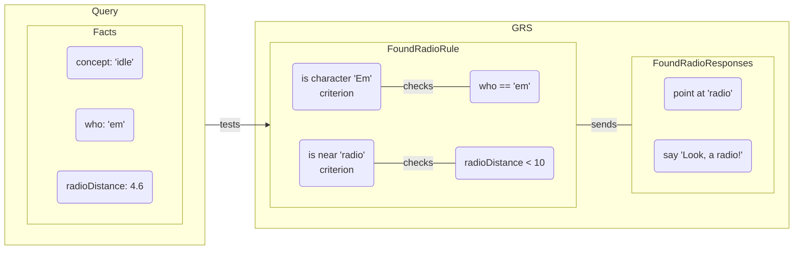
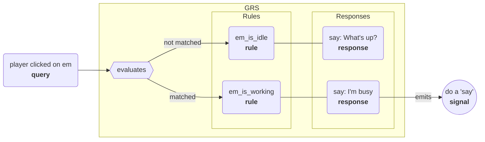

# Godot Response System

GRS lets NPCs and other entities in your game respond (speak, animate, do actions, etc) based on what happens in the game and what others do/say. Writers can easily add, remove, or edit responses in your game's GRS spreadsheet, which is exported and then loaded by the system, which tells the entities in your game what to do in response to inputs.

## Overview

GRS is designed after Valve's response system used in the Source engine, and described in their GDC talk ["Rule Databases for Contextual Dialog and Game Logic"](https://youtu.be/tAbBID3N64A). It also borrows heavily from the [Response System docs](https://developer.valvesoftware.com/wiki/Response_System) on the Valve Developer Wiki. I recommend watching that talk and reading that page, as it'll give you a good idea of why and how this system works.

Basically:

- The system is designed to make contextual dialog, actions, sounds, and more easy to manage.
- It's designed with **writers** in mind, and tries to make it as easy as possible for them to create and edit responses.

To do so:

- Your game runs the Godot Response System (GRS).
- Each entity that can respond (NPCs, etc) is an 'actor'.
- Your actors send queries to GRS whenever **something they may need to respond to** happens.
- GRS searches the rule database you've loaded, and if there's a matching rule GRS sends the response to the actor.
- The actor emits a signal containing the response info. e.g. the name of the animation to play or the text to display.

## Response system nodes

- `GRS`:
	- A `GRS` singleton is added to your game by the plugin.
- `GrsActor`:
	- You add one of these to each entity (NPC, etc) that `GRS` sends responses to.
	- When created, it automatically adds itself to `GRS`. This lets that actor get responses from `GRS`, which the actor then emits as signals.
	- When removed from the node tree, it removes itself from `GRS`.
- `GrsFactDictionary`:
	- Contains context about the world, actor, and more, which inform response choices.
	- GRS sees game context by looking at the values in fact dictionaries.
- `GrsQuery` (submitted for each event/etc to be evaluated).
	- One of these is created for each event to be evaluated by `GRS`.
	- Queries are **dispatched** to `GRS`.
	- Contains:
		- `concept`: tells `GRS` what kind of event it's receiving (idle, question, answer, just hit, etc).
		- `actor`: which actor originated this query.
		- fact dictionary: contains context related to the query itself.
	- By default, facts are searched for in this order:
		- `GrsQuery`'s fact dictionary (most specific, contains concept, etc).
		- `GrsActor`'s fact dictionary (contains any information set on the actor).
		- `GRS` root fact dictionary (contains any game-wide info).
	- But you can also supply extra fact dictionaries. For example, maybe you want to supply a 'map' fact dictionary, a fact dictionary about the actor's faction or guild, or something different.

-----

Here's a high-level example of how `GRS` and `GrsActor`s interact. Dashed lines are queries sent to GRS and solid lines are signals emitted from the given `GrsActor`:

## Response system data

Here's a description of the different types of files the response system loads. Our default importer takes a JSON file, created based on the contents of [base.yaml](./base.yaml).

Here's how the types of data are related:

## Using the response system

Here's what happens when a query is evaluated by GRS:

Basically, when a query is dispatched to `GRS` it evaluates the rule database. If found, the best matching rule's response is used. The response emits a signal from the `GrsActor` that's evaluating the query. The node with that `GrsActor` can then accept that signal and, for example, display the string in a textbox or play a voice line.
